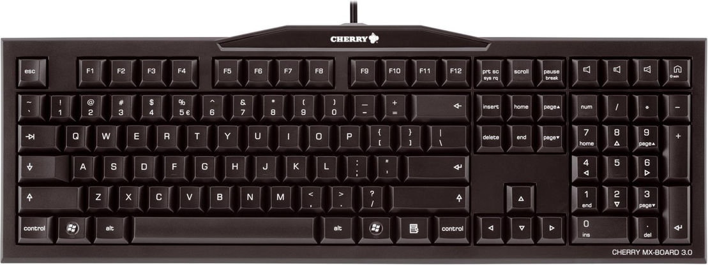
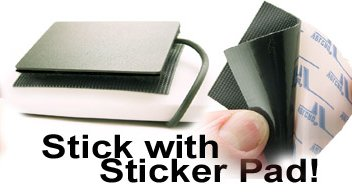
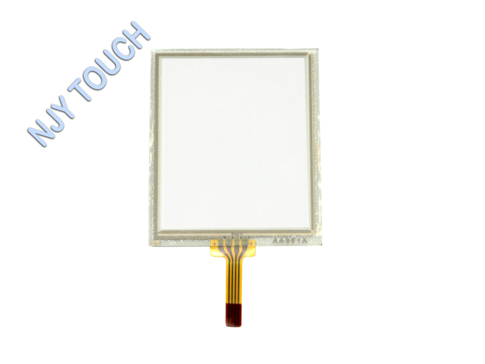
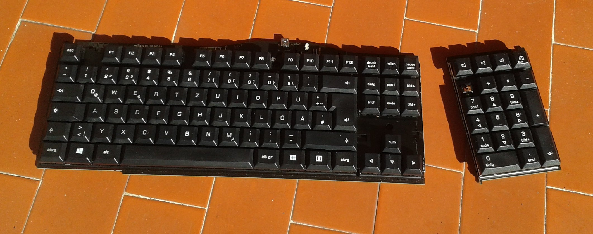
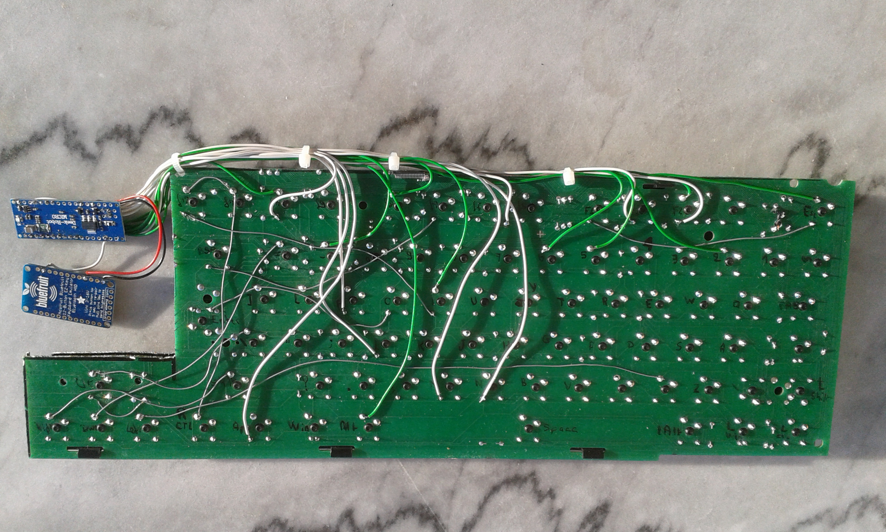
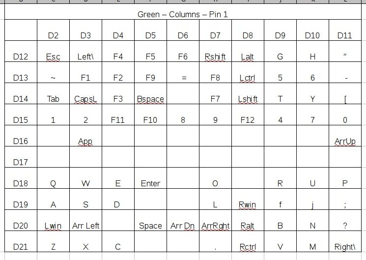
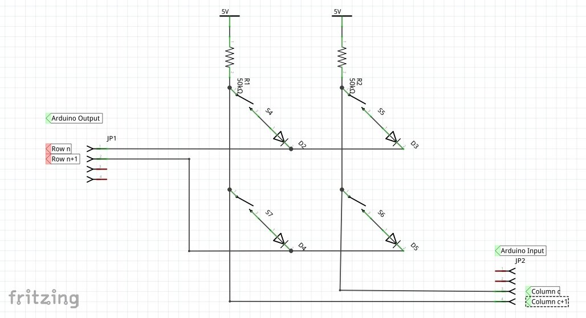

# Hybrid USB and Bluetooth Keyboard based on a Cherry MX 3.0 

##0- Todo
Document the btkbdemu and bluetooth utilities

##1- Objectives

I have multiple repositories on this github on the topic of keyboards, and keyboard hacking. Here are my objectives

* Use a good quality keyboard. Mechanical keyboard is preferred   
* Should be compact. I consider the numeric keypad to be a waste of space.   
The numeric keypad has the extra nuisance that it more or less fores you to misalign the center of your keyboard to the left of the center of the screen. This is not ergonomic 
* Restrict the usage of the mouse to a strict minimum. Whenever possible, use the keyboard, or keyboard shortcuts instead of the mouse.  
When there is no keyboard alternative, a pointing device is necessary. 
But this pointing device cannot be a mouse. After years of using a mouse, my right hand would find the mouse if there is one, and use it when it would be better avoided. A simple and small touchpad is preferred
* Remap the keyboard
Caps Lock is a useless key. Remap it as left mouse key
My Europen Cherry MX has one extra key between the left shift and the "Z" key. This key is a duplicate of the "\" key, which is not strictly required. Remap it as a mouse right click
 




##3- Components
*Cherry MX USB keyboard with brown switches
I already own a Cherry MX 3.0, and like the quality. I was about to buy a second one, but was lucky to find one at a good price on an local auction web site. 
Other mechanical keyboards can probably be used as well
Avoid rubber dome / film layers keyboards, as they are very difficult to modify

*Ergo Touchpad
http://www.ergonomictouchpad.com/ergonomic_touchpad.php


*Arduino Micro Pro without headers 

*Bluefruit EZ-Link - Bluetooth Serial Link & Arduino Programmer - v1.3
https://www.adafruit.com/products/1588
Adafruit reports the item to be out of stock, I could find one device available at a local store


*Resistive touch screen. To be used later



*Thin wires, screws and this sort of things


##4- Modifications to the original Cherry MX 3.0

Mechanical keyboards are good for typing, but also good for hacking. the keys are soldered on a single layer printed circuit board (PCB). 
It makes it possible to cut and rewire keys as desired   

* Cut away the numeric keypad    
* Keep the 4 arrow keys, and cut away the 9 keys above the arrow keys (page up, page down, delete, print screen etc)
Use the space left by the 9 keys and install a USB Ergo Touchpad




##5- Wiring the modified Cherry MX 3.0

A keyboard is a matrix of rows and columns.
The cutting operations above probably interrupted some of these connections. Just reconnect them according to you best guess
In my case, this is how the rows and columns look like




```

/* Cherry MX 30 Layout - Connected Pin 4 - White (Yellow Green Blue)- Row

   D12 - 	Esc		Left\	F4	F5	F6		Rshift		LAlt	G	H	"
   D13 -	~		F1		F2		F9		=		F8		LCtrl	5 6 	-	
   D14 - 	Tab		CapsLock	F3	Bspace	F7 LShift T	Y I	[					Yellow - 	MISO
   D15 -	1	2	F10	8	9	4	7	0										Green - 	SCK	
   D16 -	
   D17 - 	Not accessible
   D18 -	Q	W	E	O	R	U	P
   D19 -	A	S	D	F	J	K	L	;
   D20 -	Z	X	C	V	m	,	.
   D21 -	B	N	Space	?	RAlt	down left right
    -	R\	RShift	
 */


/* Cherry MX 30 Layout - Connected Pin 1  Green - Column 

   D2 - 	Esc 	~	1	Q	A	Z	lwin 	Tab
   D3 -	F2	F3	F4	3	E	C
   D4 -	F1	2	W	S	X
   D5 -	F5	F9	F10	Space	BSP	Enter
   D6 -	F6	=	8	]	I	K	
   D7 -	F7	F8	9	O	L	.	RShift	
   D8 -	F11	Del	Down	
   D9 -	4	5	R	T	F	G	V	B
   D10 -	6	7	U	Y	H	J	N	M	CapsLock
   D11 -	-	P	[	; 	'	\	/Right	

   D -	Lctrl	Lalt	Lshif	Ralt	Rctl
   D -	Up	Left
   D9 -	F12	Ins	Right	
   Unconnected or unknown RWin Rctl Down Right 
 */

```




When done, try to put everything back into the orginal case


##6- Schematic

Arduino output pins (10 in total) drive low one of the rows.    
On this row, if no keys is pressed, switches are open and the pullup resistor internal to the arduino pull the input pins high. 
If one or more key is pressed, the switch is closed, and the corresponding input pin is low.

Notice the diodes, internal to the switches. Without these switches, if 3 keys were pressed at the corners of a square made by 2 lines and 2 columns, the arduino would think that the 4th key is also pressed
The diodes prevent the current to flow backwards through one of the switches, and eliminate the key ghosting effect. 
Electrically, this keyboard would be a N key roll over. The USB protocol only allows 6 keys rollover (plus the modifier keys)




##7- Cherry Switches

See the fictitious labels on pins 1 2 3 and 4 of the cherry switches on the picture below, taken on keys Q W A and S
The switch itself is between pins 1 and 2
You can see that for each switch pins 2 and 4 are wired on the circuit
There is a diode inside the switch, anode on pin 4, cathode on pin 3
And you can see that pins 3 of keys on the same row are connected (Q3 and W3, A3 and S3)


##7- Wiring the Adafruit Bluefruit EZ HID module

Connect as follows from Arduino Micro Pro to the Adafruit module
```
Arduino Micro Pro		Adafruit Module
3V3						3V3
Gnd						Gnd
Tx						Rx
```


##8- Keyboard Mapping

I only use the US QWERTY layout.
However, I remap the following keys:
```
Caps Lock	Mouse left click
Left "\"	Mouse right click
F11			Print screen
F12			Delete
```

In order to compensate the missing 9 keys above the direction keys, the left "Windows" key is used as a sort of "Fn" key as follows 
Most of the time, the left "Windows" key is used as originally designed
For the following keys, the left "Windows" key modifies the associated key as follows:
Left Win + Arrow Up		Page Up
Left Win + Arrow Down		Page Down
Left Win + Arrow Left		Page Left
Left Win + Arrow Right		Page Right

Left Win + F1			F11
Left Win + F2			F12


##9- Arduino Program

The program drives the rows, and reads the columns
By default, all rows are pulled up high. they are pulled down one at a time
For one row pulled down, each column is checked. A pressed switch will read a low value
There can be zero or many keys pressed at the intersection of this row, and any one of the columns. 

There are less than 100 keys, and not more than 10 keys per row or per column. It is therefore convenient to build a 10 x 10 lookup table, using decimal notation


```
	for(rowCounter=row1; rowCounter<(row10 +1); rowCounter++)
		{
				scanRow(); // switch on one row at a time

				for(columnCounter = colA; columnCounter <colJ +1; columnCounter++)
				{


						readColumn(); // read the switch pressed
						if ((foundCol== true) && (keyCount++ <3)) // k roll over limited to 3
						{

```


```
void readColumn()
{

		foundColumn = digitalRead(columnCounter);
		if(foundColumn == 0)
		{
				foundCol = true;
```


```
char keyLookup[10 * 10];
char winKeyLookup[10 * 10];

```

and initialize the lookup table with the arduino value for the corresponding key

```
		keyLookup[4] = KEY_F6;
		keyLookup[5] = KEY_RIGHT_SHIFT;
		keyLookup[6] = KEY_LEFT_ALT;
		keyLookup[7] = 'g';
```
Special handling must be taken with the "print screen" key, which is missing in the arduino definition
	
```
		keyLookup[36] = 0xce;			// F11 is print screen
```
	
Notice the second lookup table which implements the special behaviour of the left "Windows" key
```
char winKeyLookup[10 * 10];

	keyLookup[12] = KEY_F1;
	winKeyLookup[12] = KEY_F11;			// F1 is F11 when lwin is down


	if (isLWinDown == 0)
	{
		Keyboard.release(keyLookup[i]);
	}
	else
	{
		Keyboard.release(winKeyLookup[i]);
	}
```
	
	
	
##10- Mode Switch - USB or Bluetooth

On power on, USB mode is active
When the key combination Left Control + Left Alt + Right Shift is pressed --> Switch to bluetooth mode
When the key combination Left Control + Left Alt + Left Shift is pressed --> Switch to usb mode

```
#define MODE_USB 	0
#define MODE_BT 	1
```

Switching between USB and Bluetooth is implemented as follows:

```

		if ((isKeyPressed[6] == 1) && (isKeyPressed[16] == 1) && (isKeyPressed[26] == 1))
		{
			Serial.println("Switching to usb");
			mode = MODE_USB;
		}

		else if ((isKeyPressed[6] == 1) && (isKeyPressed[16] == 1) && (isKeyPressed[5] == 1))
		{
			Serial.println("Switching to bt");
			mode = MODE_BT;
		}
```

Serial1 sends the key information to the Bluefruit Bluetooth adapter, to the paired bluetooth device


```


		if (mode == MODE_USB)
		{
			...
			Keyboard.press(keyLookup[i]);
			...
		}
		if (mode == MODE_BT)
		{	
			...
			Serial1.print(btLookup[i]);
			...
		}
```


##11- Bluetooth Pairing 

Adafruit made pairing very simple (as long as the push button is accessible, or wired to an accessible switch.
Simply press the pairing button on the bluetooth adapter for 5 seconds. The adapter is in discoverable mode. Scan for bluetooth devices from the phone, or other device
A bluefruit device should pop up. I can be paired without using any pin code 


##12- Limitations

The very nice Adafruit Bluefruit EZ HID module has one strong limitation: it can only be paired to one target
It is not possible to switch from one device to another one without a (simple) repairing 
Trying to get more information from Adafruit. 


##13- Future extension
3.3" Touch Screen Panel Digitizer Film to Glass 70x56mm MP4 MP5 GPS Replacement
http://www.ebay.ch/itm/371593680880?euid=e4055c0f5092443bba7906763dcfad3e&bu=44011322663&cp=1&sojTags=bu=bu

